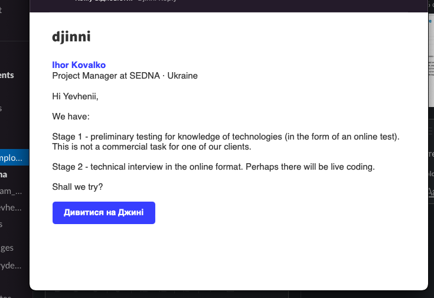

# TelegramBot
This telegram bot work with https://paper-trader.frwd.one/.
It get crypto trade pair, randomly fill empty fields on site and  return you the image with results. 

# Installing using GitHub
```shell
git clone git@github.com:zhulich/TelegramBot.git
python -m venv venv
pip install -r requirements.txt
export API_KEY = 'ENTER YOUR API';
python main.py
```
